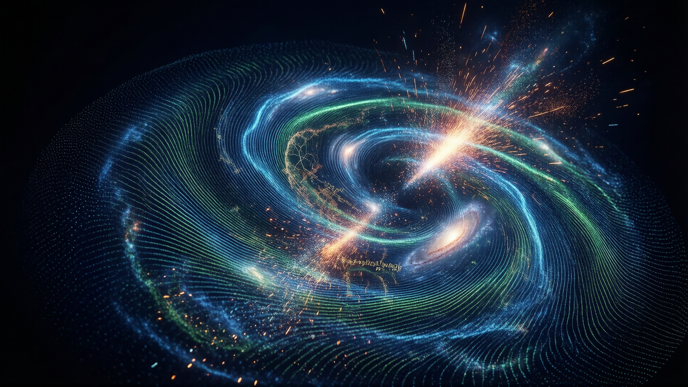

## Overview
Dark energy is a hypothetical force proposed to explain the observed accelerated expansion of the universe. It is considered one of the most significant discoveries in cosmology and constitutes approximately 68-70% of the universe's total energy content.

## History
The understanding of the universe's expansion began with the work of several key astronomers:
- **Henrietta Swan Leavitt** discovered the period-luminosity relationship in Cepheid variables, which allowed scientists to measure distances to stars and galaxies.
- **Vesto Slipher** used a spectrograph to observe redshifts in distant galaxies, indicating their movement away from Earth.
- **Alexander Friedmann** and **Georges Lemaître** independently proposed that the universe could be expanding based on Einstein's theory of general relativity.
- **Edwin Hubble** and **Milton Humason** confirmed this expansion in 1929 through measurements of redshift and galaxy distances, establishing Hubble's Law.

In 1998, **Adam Riess**, **Saul Perlmutter**, and **Brian Schmidt** observed Type 1a supernovae appearing dimmer than expected, leading to the conclusion that the universe's expansion is accelerating. This discovery introduced the concept of dark energy as a force causing this acceleration.

## Key Concepts  
Dark energy is hypothesized to be responsible for the increasing rate at which the universe expands. It is distinct from dark matter, which accounts for about 85% of the universe's mass. While the nature of dark energy remains elusive, with theoretical explanations including vacuum energy (cosmological constant), quintessence, cosmic defects, and others, recent findings introduce Dark Energy Density Models. These models propose two scenarios: a constant dark energy density or an evolving one over time.

Theoretical models also suggest that some dark matter particles may carry an electric charge, challenging assumptions about their neutrality and offering new avenues for detection. This adds another layer to understanding the universe's structure and dynamics.

Gravitational lensing has emerged as a powerful tool in cosmological research, enabling scientists to map dark matter and mass distribution by observing how light from distant objects is bent by intervening galaxies. Dozens of newly discovered gravitational lenses provide insights into ancient galaxies and dark matter properties, enhancing our understanding of cosmic structure formation.

Alternative theories propose modifying general relativity to explain the universe's expansion without invoking dark energy, such as through unimodular gravity or the Timescape Model. The Timescape Model attributes the observed acceleration of cosmic expansion not to dark energy but to differences in time dilation between galaxies and cosmic voids. According to this model, clocks in galaxies run slower than in voids due to gravitational effects, creating an illusion of accelerated expansion that does not require dark energy.

These competing explanations highlight the ongoing efforts to unravel the mysteries of cosmic acceleration and the fundamental nature of dark energy.

## Cosmic Microwave Background (CMB) and Dark Matter Distribution

The Cosmic Microwave Background (CMB), often referred to as the "echo of the Big Bang," provides critical insights into the distribution of matter in the universe. Minute temperature fluctuations in the CMB, detected by advanced instruments like the South Pole Telescope, have confirmed that dark matter constitutes approximately 27% of the universe's mass-energy content. These fluctuations serve as a sort of cosmic map, revealing the large-scale structure of the universe and the role of dark matter in shaping it.

The South Pole Telescope (SPT), located at the Amundsen-Scott South Pole Station, has been instrumental in measuring these CMB fluctuations. By observing the subtle variations in the CMB's polarization and temperature, the SPT provides high-resolution data on the distribution of matter, including dark matter, across vast cosmic distances. This information is crucial for understanding how dark matter influences the formation of galaxies and galaxy clusters.

The findings from the South Pole Telescope align with other large-scale surveys, reinforcing the consensus that dark matter plays a pivotal role in the structure of the universe. These observations not only confirm the existence of dark matter but also provide valuable constraints on its properties, helping to refine models of cosmic evolution and the interplay between dark matter and dark energy in shaping the universe's history.

## Dark Energy Non-Existence Hypothesis

A significant challenge to the existence of dark energy has been proposed by researchers suggesting that perceived acceleration in the universe's expansion might be misinterpreted. This hypothesis argues that what is attributed to dark energy could instead be variations in the kinetic energy associated with the expansion itself, rather than an unseen force. Another alternative explanation comes from the concept of gravitational time dilation, where gravity slows time in galaxies compared to cosmic voids, leading to apparent accelerated expansion without dark energy.

In a study published in *Monthly Notices of the Royal Astronomical Society Letters*, Kiwi researchers presented evidence challenging the need for dark energy as a separate entity. They propose that the observed cosmic acceleration might stem from fluctuations in the expansion rate over time, potentially linked to the universe's large-scale structure and density variations. Additionally, the timescape model posits that clocks in galaxies run slower than in voids, allowing more space expansion and mimicking dark energy effects.

These perspectives shift the paradigm by suggesting that dark energy is not an additional component of the universe but rather a misinterpretation of existing dynamics. While these hypotheses have garnered attention within the scientific community, they remain contentious topics, as they significantly impact our understanding of cosmic evolution and the fundamental forces at play.

## Dark Energy Survey (DES) Methodology  

The Dark Energy Survey (DES), conducted from 2013 to 2019, was a collaborative international effort aimed at understanding the effects of dark energy on the universe's expansion. Utilizing the Dark Energy Camera (DECam), mounted on the 4-meter Blanco telescope at the Cerro Tololo Inter-American Observatory (CTIO) in Chile, the survey employed advanced observational techniques to map large-scale cosmic structures and measure the distribution of mass.

The primary methodology involved gravitational lensing, specifically weak lensing measurements, which detect subtle distortions in galaxy shapes caused by the gravitational influence of massive objects. These distortions provided insights into the distribution of matter, including dark matter, across vast cosmic distances. Additionally, the survey tracked the brightness variations of Type Ia supernovae to measure cosmic distances and expansion rates.

Covering 5,000 square degrees of the southern sky, the DES collected data from over 669 million galaxies, capturing images across 758 nights of observation. This extensive dataset enabled researchers to create detailed maps of the universe's large-scale structure, providing critical evidence for the accelerating expansion driven by dark energy. The survey's findings significantly advanced understanding of dark energy's role in cosmic evolution and laid the foundation for future precision cosmology studies.

In a related advancement, the Dark Energy Spectroscopic Instrument (DESI), set to deploy on the Mayall telescope at Kitt Peak in Arizona, will perform precision spectroscopic measurements of distant cosmic objects, further enhancing our ability to study dark energy's effects on the universe.  

The survey's findings significantly advanced understanding of dark energy's role in cosmic evolution and laid the foundation for future precision cosmology studies.

## Fermilab's Dark Energy Experiments

Fermilab, a leading center for particle physics and astrophysics, plays a pivotal role in advancing our understanding of dark energy through cutting-edge experimental work. The laboratory's contributions include developing advanced instruments and participating in large-scale cosmic surveys designed to probe the properties of matter, space-time, and their interactions on vast scales.

One of Fermilab's most notable achievements is its involvement in the construction of the Dark Energy Camera (DECam), a high-precision instrument used in the Dark Energy Survey (DES). Mounted on the 4-meter Mayall Telescope in Chile, DECam enables wide-field imaging crucial for studying cosmic structures and dark energy effects. This collaboration has significantly advanced our ability to map the universe's large-scale structure.

Additionally, Fermilab is deeply involved with the Large Synoptic Survey Telescope (LSST), now known as the Vera C. Rubin Observatory. The lab contributed to the development of the LSST Camera, which will revolutionize dark energy research by creating a comprehensive 3D map of the cosmos, offering unprecedented insights into the effects of dark energy over time.

Fermilab's expertise extends beyond telescopes; they also utilize particle detectors like NOνA and IceCube for neutrino physics. Neutrinos, abundant but elusive particles, provide valuable information about cosmic structure and evolution, helping to unravel the mysteries of dark energy through their weak interactions with matter.

Through these experiments and collaborations, Fermilab continues to push the boundaries of dark energy research, combining precision measurements with innovative technology to address one of the most pressing questions in modern cosmology.

## Improved Supernova Light Curve Analysis

Recent advancements in supernova light curve analysis have provided new insights into the universe's expansion, challenging existing assumptions about dark energy. By employing enhanced computational methods and statistical models to analyze Type Ia supernovae data, researchers have observed variations in the rate of cosmic expansion across different regions of the universe. These findings suggest that the expansion is more "lumpier" than previously thought, with localized differences in density influencing how quickly space stretches in various areas.

This improved analysis reduces reliance on dark energy as a uniform explanation for universal acceleration, instead pointing to a more complex interplay between matter distribution and cosmic dynamics. While dark energy remains a plausible explanation, these results introduce new questions about the homogeneity of its effects and whether other factors could account for observed expansion patterns.

The implications of this research are significant, as they challenge the traditional ΛCDM model's assumption of a smooth and uniform dark energy-driven expansion. Instead, they suggest that cosmic structure plays a more dynamic role in shaping the universe's evolution. This shift in perspective encourages further investigation into how large-scale structures influence local expansion rates and whether dark energy behaves consistently across all regions of space.

## NASA's Role in Studying Dark Energy
NASA is actively involved in studying dark energy through various missions and initiatives:
- **Euclid Mission (launched 2023):** Maps the universe's structure to study dark energy effects over time.
- **Nancy Grace Roman Space Telescope (launching May 2027):** Creates a 3D dark matter map and observes Type Ia supernovae, with a field of view 100 times that of the Hubble Space Telescope.
- **Vera C. Rubin Observatory (operational 2025):** A ground-based observatory supporting dark energy research.
- **James Webb Space Telescope (launched 2021):** Contributes to dark energy studies through infrared observations.
- **SPHEREx Mission (launching April 2025):** Surveys galaxies in near-infrared light, aiding in understanding dark energy.

## Collaborative Efforts  
NASA collaborates with international partners, such as the European Space Agency (ESA), on missions like Euclid and Roman to advance cosmological studies. Additionally, NASA works with the Pan-STARRS-1 Science Consortium, which conducts wide-field surveys of celestial objects, contributing valuable data to our understanding of dark matter and dark energy. Furthermore, citizen science projects like **Dark Energy Explorers** allow public participation in dark energy research.

## DES Legacy and Future Projects

The Dark Energy Survey (DES) has established a robust foundation for future cosmological studies by demonstrating the effectiveness of gravitational lensing and standard candles like Type Ia supernovae in mapping cosmic expansion. Its methodologies have influenced next-generation projects, ensuring that dark energy research continues to advance with greater precision.

One such project is the Vera C. Rubin Observatory, set to begin operations in 2025. This observatory will utilize DES's techniques on a grand scale, providing a comprehensive 3D map of the universe and significantly advancing our understanding of dark energy through its wide-field surveys. Similarly, the Euclid Satellite, launched by the European Space Agency in 2023, builds on DES's work by focusing on galaxy clustering and weak lensing to study dark energy's effects over cosmic time.

NASA's upcoming Nancy Grace Roman Space Telescope further extends DES's legacy with its large field of view and focus on infrared observations. Together, these future missions, along with ongoing collaborations like Dark Energy Explorers, ensure that the insights gained from DES will continue to shape our understanding of the universe's accelerating expansion and the enigmatic dark energy driving it.

### DES Collaboration Scale

The Dark Energy Survey (DES) was a monumental international collaboration involving over 400 scientists and institutions from around the world. This six-year initiative brought together expertise from diverse fields, including astronomy, physics, and data science, to tackle one of the most pressing questions in modern cosmology. Collaborators included leading research institutions, universities, and organizations across North America, Europe, South America, and Asia.

Fermilab played a pivotal role in building and operating the Dark Energy Camera (DECam), the heart of the survey's observational capabilities. The U.S. National Science Foundation provided significant funding and support for the project, enabling access to world-class facilities like the 4-meter Mayall Telescope in Chile, where DECam was mounted.

The collaboration's scale extended beyond just the scientific effort. Thousands of individuals contributed to the project, from engineers and astronomers to computer scientists and data analysts. This global partnership ensured that DES had access to a wide range of expertise, resources, and perspectives, making it one of the most comprehensive cosmological studies ever conducted. The survey's success demonstrated the power of international collaboration in advancing our understanding of the universe.

## Rubin Observatory LSST Survey Scale

The Vera C. Rubin Observatory's Legacy Survey of Space and Time (LSST) represents a significant leap forward in astronomical research, particularly in the study of dark energy. Unlike the Dark Energy Survey (DES), which was conducted using the 4-meter Mayall Telescope in Chile, the LSST will utilize the newly constructed Rubin Observatory, equipped with an advanced 8.4-meter telescope and a wide-field camera capable of capturing an unprecedented amount of data.

The scale of the LSST is monumental, dwarfing previous efforts like DES. It aims to survey approximately 200 million galaxies over a decade, covering a vast area of the sky. This extensive survey will provide a detailed map of the universe's structure, tracing dark energy's influence across cosmic time with unparalleled precision.

The observatory's location in Chile offers optimal observing conditions, with minimal atmospheric interference and long stretches of clear night skies. This strategic placement ensures that LSST can maximize its observational efficiency and gather high-quality data crucial for advancing our understanding of dark energy.

By building on the foundation laid by DES and other surveys, the LSST will explore deeper into the cosmos, offering new insights into the nature of dark energy and its role in shaping the universe's expansion. This ambitious project promises to be a cornerstone of future cosmological studies, providing a comprehensive dataset that will guide scientists for years to come.

## Replication Across Datasets

Multiple experiments, including DES, ACT, and Euclid, have observed similar trends, reducing concerns about potential biases. The consistency across datasets strengthens the case for evolving dark energy.

## Implications

If confirmed, the dynamic nature of dark energy would challenge the ΛCDM model, potentially leading to new theories of cosmic evolution and resolving existing tensions between different cosmological probes.

## Future Research

Upcoming missions like the Vera C. Rubin Observatory and the Nancy Grace Roman Space Telescope promise further insights into dark energy's properties, aiming to provide precise measurements and continue collaborative efforts. Additionally, the Giant Magellan Telescope (GMT) is expected to advance our understanding by detecting faint dwarf galaxies currently invisible to existing instruments. This capability will help resolve discrepancies between predicted and observed dwarf galaxy counts, shedding light on dark matter distribution and its interplay with dark energy's effects on cosmic structure.

## Cosmological Constant

The Lambda-Cold Dark Matter (ΛCDM) model assumes dark energy is represented by a cosmological constant, implying its density remains constant over time. This model has been widely accepted but faces challenges from new evidence suggesting otherwise.

## Time-Dependent Dark Energy

Recent studies propose that dark energy's energy density decreases over time, with statistical significance approaching 99.99% confidence (3.9 sigma). This hypothesis suggests a dynamic rather than static nature for dark energy, which could significantly alter our understanding of cosmic evolution.

## Collaborative Discoveries

The DESI collaboration and other projects have provided substantial evidence for time-dependent dark energy. Their findings include preferential support for evolving dark energy at 99.995% (4.2 sigma) significance using BAO measurements, and enhanced constraints from data releases like DR2.

## New Zealand Dark Energy Study Collaboration

The **New Zealand Dark Energy Study Collaboration**, led by Professor David Wiltshire at the University of Canterbury (UC), represents an international effort challenging conventional theories about dark energy. This collaboration includes researchers such as Ryan Ridden-Harper, Zachary Lane, Antonia Seifert, and Marco Galoppo, alongside U.S.-based counterparts at the Space Telescope Science Institute. Their work focuses on refining cosmological models by analyzing large-scale structure data and supernova observations, aiming to provide new insights into dark energy's behavior.

The team has developed innovative computational cosmology techniques to simulate cosmic expansion patterns, exploring modified gravity models that could explain acceleration without invoking dark energy. These simulations aim to reconcile discrepancies between theoretical predictions and observational data, particularly in understanding density fluctuations across the universe.

This research contributes significantly to dark energy studies by offering alternative perspectives on cosmic dynamics, enhancing our comprehension of the forces shaping the universe's evolution. Their findings align with existing evidence while introducing novel interpretations that expand the scope of cosmological theory.

## References

[^1]: [What is Dark Energy? Inside Our Accelerating, Expanding Universe - NASA ...](https://science.nasa.gov/dark-energy/)
[^2]: [The Dark Energy Survey shines light on space's biggest question](https://news.northeastern.edu/2026/01/23/dark-energy-survey/)
[^3]: [The inconstant cosmological constant | Nature Astronomy](https://www.nature.com/articles/s41550-025-02549-z)
[^4]: [Dark energy doesn't exist, according to new NZ study](https://www.canterbury.ac.nz/news-and-events/news/2024/dark-energy-doesn-t-exist--according-to-new-nz-study)
[^5]: [Dark Energy and Dark Matter | Center for Astrophysics | Harvard ...](https://www.cfa.harvard.edu/research/topic/dark-energy-and-dark-matter)
[^6]: [Dark Energy | Fermilab Cosmic Physics Center](https://astro.fnal.gov/science/dark-energy/)