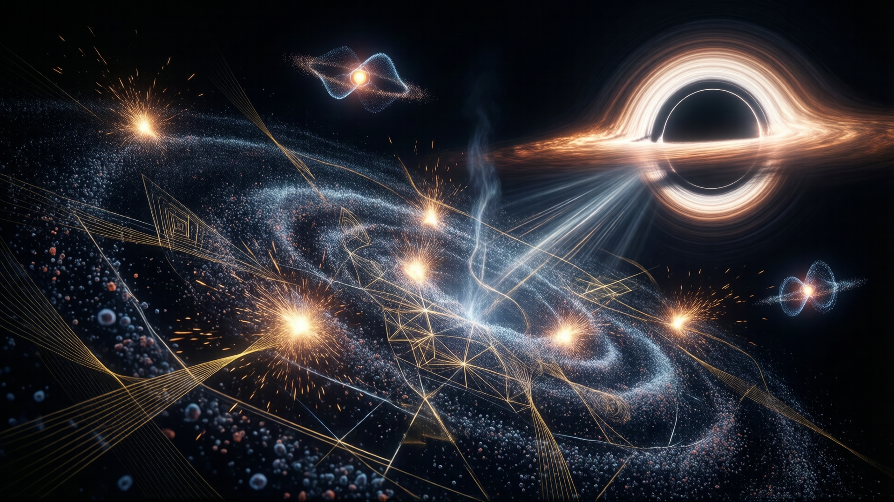

The Dirac equation is a fundamental equation in quantum field theory that describes the behavior of fermions, such as electrons, while adhering to both special relativity and quantum mechanics. Formulated by British physicist Paul Dirac in 1928, it has profoundly influenced modern physics.

## Overview
The Dirac equation addresses the challenge of reconciling quantum mechanics with special relativity. It successfully describes the dynamics of fermions, particles with half-integer spin, including electrons. The equation's unique feature is its prediction of antimatter, which has been experimentally confirmed and revolutionized particle physics.

### Relativistic Invariance  
The Dirac equation remains invariant under Lorentz transformations, ensuring its validity across all inertial reference frames regardless of relative velocities. This invariance is a cornerstone of relativistic quantum mechanics, allowing the equation to describe particles like electrons consistently at high energies and speeds approaching the speed of light.  

In addition to this invariance, the Dirac equation represents spinors using **scalar** and **pseudoscalar bi-linear quantities** under Lorentz transformations. These bi-linear combinations ensure that the equation maintains its mathematical structure while accommodating the spin-½ nature of particles. This representation is critical for describing phenomena such as particle-antiparticle annihilation and the intrinsic parity of fermions.

### Spin Description
It incorporates the spin of particles, a crucial aspect for describing fermions. This feature allows the equation to account for the intrinsic angular momentum of electrons and other fermions. Additionally, the Dirac equation predicts the magnetic moment of particles using the formula -μD = qSm, where S is the spin vector.

### Negative Energy Solutions
The equation predicts negative energy states, initially perplexing physicists but leading to the concept of the Dirac sea and the understanding of antimatter.

## Mathematical Formulation  
The Dirac equation is expressed in terms of a spinor field \( \psi \), which acts as the wavefunction describing particles with spin. This wavefunction incorporates both quantum mechanical and relativistic properties, enabling it to account for spin and antimatter:  
\[
(i \gamma^\mu \partial_\mu - m) \psi = 0
\]  
This equation can also be written in an equivalent formulation using explicit components:  
\[
(\beta mc^2 + c \sum_{n=1}^3 \alpha_n p_n)\psi(x,t) = i\hbar \frac{\partial \psi(x,t)}{\partial t}
\]

The Dirac equation is typically formulated in the **Dirac representation**, where the gamma matrices are represented as block matrices. However, alternative formulations exist for different types of spinors:  

- The **Weyl (Chiral) Representation** emphasizes chirality by splitting the spinor field into left-handed and right-handed components. This formulation is particularly useful for understanding particles like neutrinos, which exhibit chirality.  
- The **Majorana Representation** describes Majorana fermions, particles that are their own antiparticles. In this representation, the spinor field satisfies a reality condition, making it real-valued and enabling the description of Majorana masses.  

These alternative formulations highlight the Dirac equation's versatility in describing different types of spinors, from standard charged leptons to neutrinos and Majorana fermions.

- **\( \gamma^\mu \)**: Dirac gamma matrices, essential for the equation's structure.  
- **\( \partial_\mu \)**: Partial derivative in spacetime.  
- **\( m \)**: Mass of the particle.  
- **\( \beta \)**: A diagonal matrix in Dirac representation, related to time evolution.  
- **\( \alpha_n \)**: Off-diagonal matrices in Dirac representation, associated with spatial components.  
- **\( p_n \)**: Momentum operators in three-dimensional space.  
- **\( \psi(x,t) \)**: Spinor field dependent on spacetime coordinates \( x \) and time \( t \).  
- **\( c \)**: Speed of light in vacuum.  
- **\( \hbar \)**: Reduced Planck's constant.  
- **Majorana Representation**: A formulation describing Majorana fermions, particles that are their own antiparticles.

## Solutions and Interpretations  
The Dirac equation yields both positive and negative energy solutions, which were initially problematic but led to significant advances in physics. These solutions provided a foundation for hole theory and the discovery of antimatter, notably predicting the existence of positrons—the antiparticles of electrons. This prediction was experimentally confirmed, marking a major success for Dirac's equation.  

However, Dirac's theory faced challenges when experimental data contradicted his predictions regarding hydrogen atom electron energy levels and magnetic moments. These discrepancies highlighted limitations in the original formulation of the Dirac equation. The issues were later resolved through the work of Julian Schwinger on quantum electrodynamics (QED), which introduced concepts like mass and charge renormalization to reconcile theory with experimental results.

In addition to these developments, the Foldy-Wouthuysen transformation emerged as a method to simplify the non-relativistic interpretation of the Dirac equation. This transformation separates relativistic and non-relativistic components, offering an alternative formulation that enhances our understanding of the equation's behavior in various limits.

### Quantum Field Theory
Cornerstone of quantum electrodynamics (QED) and other relativistic quantum field theories, enabling accurate predictions in particle physics.

## Spin-Statistics Theorem Connection

The Dirac Equation inherently incorporates the spin-statistics theorem, which establishes a fundamental link between the intrinsic spin of fermions and their quantum statistical properties. This theorem asserts that particles with half-integer spin, such as electrons, must obey Fermi-Dirac statistics, while those with integer spin adhere to Bose-Einstein statistics. The Dirac Equation's mathematical framework enforces this relationship through its use of spinors, which are four-component entities representing the wavefunctions of fermions.

In the context of the Dirac Equation, the spin-statistics connection is manifest in the symmetry properties of the wavefunction under particle exchange. For fermions, the total wavefunction must be anti-symmetric upon the exchange of two particles, a requirement that directly leads to the Pauli exclusion principle. This principle prohibits identical fermions from occupying the same quantum state simultaneously, a cornerstone of quantum mechanics.

Dirac's formulation not only resolved the issue of negative probability densities in earlier relativistic wave equations but also provided a mathematical foundation for understanding the statistical behavior of fermions. By inherently connecting spin and statistics, the Dirac Equation laid the groundwork for the development of quantum field theory and the unification of various subfields within theoretical physics.

This connection has profound implications across modern physics, from explaining the behavior of electrons in atoms to underpinning our understanding of quark interactions in high-energy environments. The Spin-Statistics Theorem, as realized through the Dirac Equation, remains a pivotal concept in the study of quantum field theory and particle physics.

## Relativistic Effects on Chemistry

Relativistic effects play a significant role in the chemical behavior of elements with high atomic numbers, such as gold (Au) and mercury (Hg). Due to their electrons moving at speeds close to the speed of light, relativistic quantum mechanics becomes essential for understanding their properties. These effects lead to deviations from predictions based on non-relativistic quantum theory.

One notable example is the coloration of gold. The relativistic contraction of atomic orbitals in heavy atoms causes a shift in electron energy levels, particularly affecting the s-orbitals more than the p-orbitals. This difference alters the electronic transitions responsible for gold's distinctive yellowish-gold color. Similarly, mercury exhibits unique chemical properties due to relativistic effects, such as its liquid state at room temperature and its reactivity differences compared to lighter elements in the same group.

In addition to visual and physical properties, relativistic effects influence chemical bonding and reaction mechanisms. For instance, the contraction of orbitals affects bond lengths and strengths, impacting how these heavy atoms interact with other elements. These relativistic effects also contribute to anomalies in standard periodic trends, such as the lower ionization energy of mercury compared to lighter group 12 elements.

Furthermore, isotopic variations in heavy elements highlight the impact of relativity on chemical behavior. Heavier isotopes experience greater relativistic contraction, leading to differences in atomic size and electronic structure that can alter chemical reactivity. This phenomenon underscores the importance of considering relativistic effects when studying the chemistry of high-Z elements.

In summary, relativistic effects significantly influence the chemical properties of heavy atoms, affecting everything from their color and physical state to their bonding behavior and reaction mechanisms. These relativistic phenomena are a unique feature of elements with high atomic numbers, enriching our understanding of how quantum mechanics and relativity intersect in chemistry.

## Anomalous Magnetic Moment

The Dirac equation provides a foundational description of the magnetic moment of electrons and other fermions. Specifically, it predicts the electron's magnetic dipole moment as \( \mu = -\frac{e}{2m} \), where \( e \) is the elementary charge and \( m \) is the mass of the electron. This prediction aligns closely with experimental observations but introduces a subtle discrepancy known as the **anomalous magnetic moment**.

The anomalous magnetic moment arises from quantum fluctuations and radiative corrections, which were not accounted for in the original Dirac equation. These effects were later incorporated into the framework of quantum electrodynamics (QED), where Julian Schwinger and others developed formalisms to calculate the precise contributions of these phenomena. The QED calculation yields a value slightly larger than the Dirac prediction, matching experimental results with remarkable precision.

This refinement demonstrates the power of QED in addressing limitations of the Dirac equation and highlights the importance of incorporating higher-order corrections for accurate predictions in quantum field theory.

## Curved Spacetime Applications

The Dirac equation can be extended to describe fermions in curved spacetime, a significant development that bridges quantum field theory with general relativity. This formulation allows physicists to study the behavior of particles like electrons in strong gravitational fields, such as those near black holes or during the early universe.

By incorporating the principles of general relativity into the Dirac equation, researchers can analyze phenomena involving fermions in non-inertial frames and curved spacetime backgrounds. This extension is particularly important for understanding quantum effects in extreme gravitational conditions, such as the vicinity of neutron stars or black holes. It also plays a role in exploring the interplay between quantum mechanics and gravity, a key area of research in theoretical physics.

The ability to formulate the Dirac equation in curved spacetime has led to advancements in our understanding of phenomena like the Casimir effect in strong gravitational fields and the behavior of fermions near singularities. These applications underscore the equation's versatility and its enduring relevance in modern physics, particularly in the context of high-energy astrophysics and quantum gravity theories.

### Condensed Matter Physics
Concepts like the Dirac sea aid in understanding superconductivity and electron behavior in metals.

## Hawking Radiation

The Dirac equation plays a crucial role in theoretical frameworks that predict particle-antiparticle pairs near black holes, contributing to the understanding of Hawking radiation. This phenomenon arises from quantum effects in the vicinity of a black hole's event horizon, where spacetime curvature is extreme.

Hawking radiation stems from the concept of "quantum tunneling," where particle-antiparticle pairs are created near the event horizon. The Dirac equation provides the mathematical foundation for describing these fermions (such as electrons) in such extreme conditions. By incorporating the principles of quantum field theory and curved spacetime, the Dirac equation helps explain how these particles can emerge from the vacuum fluctuations surrounding a black hole.

The connection between the Dirac equation and Hawking radiation underscores the deep interplay between quantum mechanics and general relativity. This theoretical synthesis has profound implications for our understanding of black holes and the ultimate fate of matter in extreme gravitational environments.

## Historical Context  
The early 20th century witnessed a revolutionary transformation in physics with the development of quantum mechanics, driven by the contributions of Max Planck, Niels Bohr, Werner Heisenberg, Erwin Schrödinger, and Paul Dirac. This paradigm shift introduced groundbreaking concepts such as wave-particle duality and quantization, reshaping our understanding of the microscopic world.

Within this context, Dirac developed his equation in 1928 to resolve inconsistencies between the Schrödinger equation and special relativity. His work not only addressed these issues but also stemmed from a broader effort to unify Maxwell's equations—describing electromagnetism—with Einstein's special relativity. This unification goal provided intellectual depth to Dirac's formulation, which ultimately laid the foundation for the discovery of antimatter and revolutionized particle physics. The Dirac equation remains a cornerstone of modern physics, offering profound insights into the relativistic behavior of fundamental particles.

## History

Before Dirac’s work, the Schrödinger equation, while successful in non-relativistic quantum mechanics, was inadequate for describing particles moving at relativistic speeds. Attempts to create a relativistic version led to inconsistencies, such as negative probability densities. The Klein-Gordon equation emerged as a solution for spin-0 particles but failed to account for spin-1/2 particles like electrons.

Dirac’s breakthrough addressed these issues by introducing a relativistic equation that correctly described electron behavior. His work not only reconciled quantum mechanics with relativity but also laid the groundwork for the discovery of antimatter. Dirac predicted the existence of positrons, which were experimentally confirmed by Carl Anderson in 1932.

## Key Concepts

The Dirac Equation introduced several key concepts that transformed theoretical physics:

- **Bispinors and Gamma Matrices**: The equation uses four-component wave functions (bispinors) and four 4×4 gamma matrices. These mathematical constructs ensure the equation’s relativistic invariance and provide a framework for understanding spin.

- **Spin as an Inherent Property**: Dirac’s formulation revealed that electrons have two internal quantum states corresponding to spin up and spin down. This insight confirmed spin as an inherent property of particles, not merely a macroscopic feature.

- **Planck's Constant (h)**: A fundamental constant in quantum mechanics, equal to $6.626 \times 10^{-34}$ joule-seconds, which quantizes energy in quantum systems. The Dirac Equation incorporates Planck's constant as part of its mathematical framework, underscoring the equation's role in unifying quantum mechanics and special relativity by providing a relativistic description of particles' spin and energy states.

## Prediction of Antimatter

One of the most significant contributions of the Dirac Equation was its prediction of antimatter. By proposing the existence of both positive and negative energy states, Dirac explained how removing an electron from the Dirac Sea could result in a hole that mimicked a positively charged particle. This theoretical work directly led to the experimental discovery of the positron by Carl Anderson in 1932.

## Legacy

The Dirac Equation remains a cornerstone of modern theoretical physics. It is essential for describing fermions—particles with half-integer spin, such as electrons and quarks—and serves as the foundation for calculations in quantum electrodynamics (QED) and high-energy physics. While later developments, such as quantum field theory, have refined our understanding of the Dirac Sea and related concepts, the equation itself continues to be a fundamental tool in theoretical physics.

Dirac’s work not only resolved inconsistencies in earlier theories but also opened new avenues for exploration, including the search for antimatter and the development of relativistic quantum mechanics. His equation remains a testament to the power of mathematical rigor and physical intuition in advancing our understanding of the universe.

## References

[^1]: [Dirac equation explained](https://everything.explained.today/Dirac_equation/)
[^2]: [What Is the Dirac Equation and What Did It Predict?](https://scienceinsights.org/what-is-the-dirac-equation-and-what-did-it-predict/)
[^3]: [Dirac Equation: Formula, Theory & Applications Explained - Vedantu](https://www.vedantu.com/physics/dirac-equation)
[^4]: [Dirac Equation - Equation, Formula, Examples, and FAQs](https://www.examples.com/physics/dirac-equation.html)
[^5]: [Dirac Equation | Research Starters | EBSCO Research](https://www.ebsco.com/research-starters/physics/dirac-equation)
[^6]: [Unlocking Quantum Secrets: Paul Dirac's Equation Explained](https://science.topicget.com/en/quantum-mechanics-study/dirac-equation-overview)