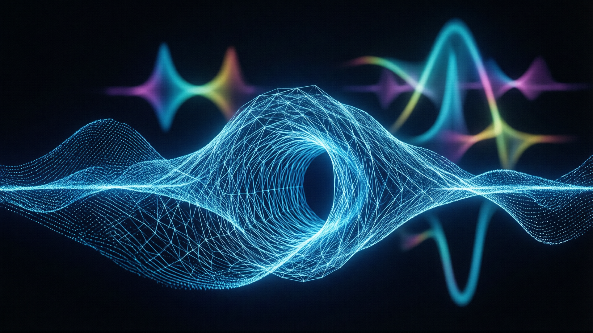

## Overview
Quantum tunneling is a fundamental phenomenon in quantum mechanics where particles, such as electrons, pass through potential barriers that they classically shouldn't be able to overcome. This effect challenges classical physics by demonstrating that probability plays a role in particle movement at the quantum level. The concept has numerous applications in nanotechnology, including the scanning tunneling microscope (STM), semiconductor devices, and understanding nuclear decay processes.

## Quantum Tunneling Metaphor

Quantum tunneling is often explained using a metaphor involving a child throwing a ball at a wall. In this analogy, the ball represents a particle, such as an electron, attempting to pass through a barrier (the wall). Classically, if the ball doesn't have enough energy to overcome the wall's height, it would bounce back. However, in quantum mechanics, particles exhibit wave-like properties, allowing them to exist in multiple states at once.

The metaphor highlights that while the child cannot physically push the ball through the wall, there is a small but non-zero probability that the ball could pass through based on chance and the unpredictable nature of its path. Similarly, particles have a probability amplitude describing their likelihood of tunneling through a barrier, even if they lack sufficient energy classically.

This analogy underscores the fundamental concept of wave-particle duality in quantum mechanics. Just as the child relies on probability to determine the ball's trajectory, particles use their wave functions to describe possible paths and outcomes. This metaphor bridges the gap between abstract quantum principles and everyday experiences, illustrating how even macroscopic phenomena can be influenced by quantum probabilities.

## Historical Context
The phenomenon of quantum tunneling was first predicted theoretically in the early 20th century as part of the development of quantum mechanics. However, it wasn't until the 1980s that practical applications like the STM were developed, revolutionizing the field of nanotechnology by enabling atomic-level imaging.

## Curiosity-Driven Scientific Discovery

The experiments in the 1980s that eventually led to the Nobel Prize in Physics in 2025 were primarily motivated by a desire to explore fundamental aspects of quantum mechanics rather than immediate practical applications. Researchers like John Clarke, Michel Devoret, and John Martinis were driven by an intrinsic curiosity about how quantum tunneling behaves at macroscopic scales. Their work was part of a broader effort to understand the underlying principles of quantum systems, without initially focusing on the potential technological applications.

This pursuit of knowledge for its own sake proved to be revolutionary. By exploring the boundaries of quantum mechanics, these scientists demonstrated that macroscopic quantum tunneling is possible, challenging classical notions of scale in quantum phenomena. Their findings not only advanced theoretical physics but also opened new avenues for technology development, even though this was not their initial objective.

The story of their research highlights the importance of curiosity-driven science in driving technological progress. Many foundational discoveries in physics begin as abstract explorations, with practical applications emerging years or decades later. The journey from pure scientific inquiry to transformative technologies underscores the value of investing in basic research.

## Key Concepts

- **Wave-Particle Duality**: The ability of particles to exhibit both wave-like and particle-like properties is central to understanding quantum tunneling. The wave nature of particles allows them to interact with potential barriers in ways that are not possible for classical particles.
- **Probability Current**: Quantum tunneling is described by the probability current, which represents the flow of particles through a barrier over time. This probability decreases exponentially as the barrier becomes wider or taller.
- **Feynman Path Integrals**: The mathematical framework developed by Richard Feynman provides a way to calculate the probability amplitudes for particles to tunnel through barriers by summing over all possible paths.

### Field Emission
Field emission occurs when electrons escape from a conductor's surface due to an external electric field. This field creates a potential barrier, and the width of this barrier is inversely proportional to the electric field strength. Stronger fields result in narrower barriers, exponentially increasing the probability of tunneling.

### Quantum Tunneling in Semiconductors
In semiconductor devices such as tunnel diodes, quantum tunneling allows current to flow through a thin potential barrier at the junction between two different semiconductors. Resonant-tunneling diodes take this principle further by aligning energy levels between a quantum dot and an external voltage, enabling current flow only at specific biases.

### STM Operation
The scanning tunneling microscope (STM) uses quantum tunneling to image surfaces at atomic resolution. The device consists of a scanning tip elevated 0.4 to 0.7 nm above the surface being scanned. The tunneling current is proportional to the probability of electrons tunneling from the surface to the tip, providing high-resolution images.

### Nuclear Decay
Quantum tunneling explains the half-life of radioactive nuclei emitting alpha particles. Higher-energy alpha particles have a narrower barrier to tunnel through, leading to shorter half-lives. The width of the nuclear barrier can be estimated using specific equations involving constants and particle energy.

## Applications

The discovery of quantum tunneling has had profound implications for modern technology. It underpins advancements in digital devices such as mobile phones, quantum cryptography, quantum computers, and quantum sensors. These technologies rely on the principles of quantum mechanics to function, showcasing the practical applications of theoretical concepts once considered abstract.

### Nanotechnology
Quantum tunneling is integral to nanotechnology applications, including STM for surface imaging and semiconductor devices like resonant-tunneling diodes. These devices exhibit nonlinear current-voltage characteristics and are used as high-speed switches in electronic circuits.

### Quantum Dots
Quantum dots, nanocrystals with finite potential wells, demonstrate resonant tunneling when an applied voltage aligns the energy levels of electrons inside the dot with those outside, enabling current flow at specific biases.

## Shift from Theoretical to Practical Quantum Mechanics

The discovery of macroscopic quantum tunneling in the 1980s marked a pivotal moment in the evolution of quantum mechanics, shifting its perception from an abstract theoretical framework to a cornerstone of practical technology. As noted by science communicator Sabine Hossenfelder, this breakthrough changed how quantum physics was viewed, transitioning it from an abstract theory to a practical scientific discipline. Prior to this innovation, much of quantum mechanics was perceived as a philosophical or theoretical discipline, with little direct application to real-world systems. Theoretical concepts like wave-particle duality and probability currents were often seen as intriguing but disconnected from everyday engineering and technology.

In 1985, researchers John Clarke, Michel Devoret, and John Martinis achieved a landmark by demonstrating macroscopic quantum tunneling in superconducting wires. This work showed that quantum principles could operate at larger scales, challenging the classical divide between microscopic and macroscopic physics. Their experiments revealed how collective electron behavior in superconductors could transcend classical physical barriers, paving the way for practical applications of quantum mechanics.

This shift transformed quantum mechanics into a foundational science for emerging technologies. The principles uncovered through macroscopic tunneling research enabled advancements in quantum computing, superconducting circuits, and secure communication systems. By demonstrating that quantum phenomena could be harnessed at scale, these discoveries bridged the gap between theoretical inquiry and technological innovation, establishing quantum mechanics as a driving force behind modern scientific and engineering progress.

## Superconducting Circuit Applications

Superconducting circuits play a pivotal role in advancing quantum tunneling applications, particularly in the realm of quantum computing and secure communication technologies. These circuits leverage the principles of macroscopic quantum tunneling to maintain quantum coherence over larger scales, enabling the development of practical quantum systems. By utilizing superconductivity, these devices can sustain coherent states longer than conventional systems, which is crucial for error correction and scalability in quantum computing.

The application of superconducting circuits extends to the creation of qubits, such as Josephson junctions, which are fundamental building blocks for quantum computers. These qubits rely on the quantum tunneling effect to perform computations that classical computers cannot efficiently handle. Additionally, these circuits are integral to developing ultra-secure communication networks through quantum key distribution (QKD), ensuring data security based on the principles of quantum mechanics.

Machiel Blok's research at the University of Rochester exemplifies the potential of superconducting circuits in exploring complex quantum systems. His work has contributed significantly to understanding how these circuits can be optimized for practical applications, paving the way for more robust and scalable quantum technologies. This research underscores the importance of superconducting circuits in bridging the gap between theoretical quantum mechanics and real-world technological implementation.

## Macroscopic Tunneling's Role in Quantum Computing

The ability to observe macroscopic quantum phenomena, such as macroscopic quantum tunneling, has been revolutionary for the field of quantum computing. This phenomenon, where collective electron behavior exhibits quantum properties at large scales, bridges the gap between theoretical quantum mechanics and practical technology development. By leveraging these effects, researchers have made significant strides in creating qubits—quantum bits—that form the basis of quantum computers.

In superconducting circuits, macroscopic quantum tunneling enables the creation of qubits such as Josephson junctions, which rely on the tunneling of Cooper pairs through thin potential barriers. These qubits exploit the principles of quantum coherence and superposition to perform computations that classical computers cannot efficiently handle. The ability to maintain quantum states in macroscopic systems has been crucial for advancing error correction and scalability in quantum computing architectures.

Furthermore, the study of qudits—quantum systems that exist in multiple states simultaneously—has gained traction due to their potential advantages over traditional qubits. By utilizing macroscopic tunneling effects, researchers can explore higher-dimensional computational spaces, which may offer improved robustness against decoherence and enhanced algorithm efficiency. This approach aligns with the growing interest in topological quantum computing, where collective electron behavior plays a pivotal role.

Recent advancements in superconducting circuit design have demonstrated the feasibility of integrating macroscopic quantum tunneling into practical quantum technologies. For instance, Machiel Blok's research at the University of Rochester has contributed significantly to understanding how these circuits can be optimized for quantum computing applications. His work highlights the potential of using qudits and advanced tunneling effects to build more complex and scalable quantum systems, paving the way for next-generation technologies that harness the power of macroscopic quantum phenomena.

## Qudits in Quantum Computing

Qudits are quantum computing units that can exist in multiple states simultaneously, offering a significant advantage over traditional qubits, which are limited to two states (0 and 1). Unlike qubits, qudits can occupy a superposition of more than two states, enabling higher-dimensional computational spaces. This capability is particularly valuable for enhancing the complexity and efficiency of quantum algorithms.

In the context of superconducting circuits, qudits leverage the principles of quantum tunneling to allow particles to transition between multiple energy levels within a system. These transitions are facilitated by the tunneling properties inherent in superconducting materials, which enable coherent state manipulation. By utilizing qudits, researchers can explore new avenues for error correction and scalability in quantum computing, as higher-dimensional systems may offer more robust protection against decoherence.

Machiel Blok's research at the University of Rochester has significantly advanced our understanding of how qudits can be implemented in superconducting circuits. His work demonstrates that these multi-state particles can be used to build more complex and scalable quantum systems, potentially revolutionizing the field of quantum computing by providing a foundation for next-generation technologies.

## Macroscopic Quantum Tunneling

Macroscopic quantum tunneling represents a significant advancement in the observation of quantum phenomena at large scales, challenging the classical division between microscopic and macroscopic realms. This phenomenon involves the tunneling of particles through potential barriers in systems that are visible to the naked eye, thereby demonstrating quantum behavior in macroscopic structures.

In 1985, researchers John Clark, Michael Devory, and John Martinez achieved a pivotal milestone by demonstrating macroscopic quantum tunneling in superconducting wires. Their breakthrough revealed how collective electron behavior could transcend classical physical barriers, marking a foundational shift from theoretical to practical quantum mechanics.

Later, in 2025, this groundwork was built upon when researchers were awarded the Nobel Prize in Physics for their work in demonstrating macroscopic quantum mechanical tunneling using superconducting circuits. These circuits exhibited quantum coherence despite facing challenges with decoherence, highlighting the potential for maintaining quantum states in larger, more complex systems.

The implications of these discoveries are profound, particularly for fields like quantum computing and communication. By enabling the manipulation of quantum tunneling at macroscopic scales, it opens avenues for developing more scalable and stable quantum technologies. This progress underscores the feasibility of integrating quantum principles into real-world applications on a larger scale than ever before.

## Conclusion
Quantum tunneling is a critical phenomenon in modern physics and technology. Its applications span from atomic-scale imaging using STM to advanced semiconductor devices and understanding nuclear decay processes. The principles of quantum tunneling continue to drive innovation in nanotechnology and quantum mechanics.

## Applications

The discovery of quantum tunneling has had profound implications for modern technology. It underpins advancements in digital devices such as mobile phones, quantum cryptography, quantum computers, and quantum sensors. These technologies rely on the principles of quantum mechanics to function, showcasing the practical applications of theoretical concepts once considered abstract.

## Nobel Prize Recognition

The experimental demonstration of quantum tunneling on a macroscopic scale was achieved in the 1980s by British physicist John Clarke, French scientist Michel Devoret, and American researcher John Martinis. Their work utilized superconductors to observe this phenomenon, earning them the Nobel Prize in Physics for their contributions to quantum mechanics and its applications.

## History

The concept of quantum tunneling was first predicted by the early pioneers of quantum mechanics in the 1920s, including Erwin Schrödinger and Werner Heisenberg. However, it wasn't observed experimentally until the late 1940s with the successful demonstration of electron tunneling through thin metal films. The development of quantum tunneling has had profound implications for both theoretical physics and practical applications. It is now a well-established phenomenon that underpins many modern technologies, including semiconductor devices and scanning tunneling microscopes.

## Key Concepts

- **Wave-Particle Duality**: The ability of particles to exhibit both wave-like and particle-like properties is central to understanding quantum tunneling. The wave nature of particles allows them to interact with potential barriers in ways that are not possible for classical particles.
- **Probability Current**: Quantum tunneling is described by the probability current, which represents the flow of particles through a barrier over time. This probability decreases exponentially as the barrier becomes wider or taller.
- **Feynman Path Integrals**: The mathematical framework developed by Richard Feynman provides a way to calculate the probability amplitudes for particles to tunnel through barriers by summing over all possible paths.

## Future Directions

As our understanding of quantum tunneling continues to evolve, new applications are being explored. Researchers are investigating how tunneling can be harnessed for advanced materials science, nanotechnology, and even energy production. The study of tunneling also remains a fundamental area of research in quantum mechanics, helping to refine our understanding of the subatomic world.

## References

[^1]: [7.7: Quantum Tunneling of Particles through Potential Barriers](https://phys.libretexts.org/Bookshelves/University_Physics/University_Physics_(OpenStax)/University_Physics_III_-_Optics_and_Modern_Physics_(OpenStax)/07%3A_Quantum_Mechanics/7.07%3A_Quantum_Tunneling_of_Particles_through_Potential_Barriers)
[^2]: [Quantum Tunneling Experiments Earn Team The Nobel Prize in Physics](https://www.sciencealert.com/quantum-tunneling-experiments-earn-team-the-nobel-prize-in-physics)
[^3]: [Quantum tunneling: URochester physicist explains a Nobel Prize-winning ...](https://www.rochester.edu/newscenter/quantum-tunneling-urochester-explains-nobel-worthy-discovery-672112/)
[^4]: [Quantum Tunneling - Physics Bootcamp](http://www.physicsbootcamp.org/sec-Quantum-Tunneling.html)
[^5]: [The 2025 Physics Nobel Prize: Macroscopic Quantum Tunneling](https://sciencereader.com/the-2025-physics-nobel-prize-macroscopic-quantum-tunneling/)