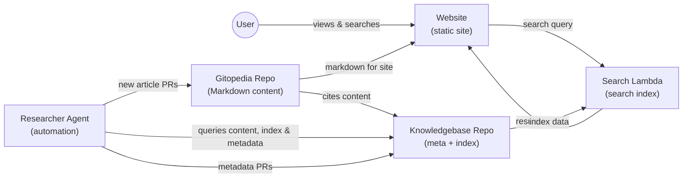

# Architecture

This document outlines how the Gitopedia system components interact to form a complete knowledge platform. The architecture diagram below shows the four main components (Gitopedia, Knowledgebase, Researcher, Website) and the data flows between them:

## Content Workflow

Gitopedia is the central content repository. All encyclopedia articles are stored here as Markdown files. These articles cite and reference content from the Knowledgebase repository. New content is added exclusively by the Researcher agent via automated Pull Requests. Articles are first staged under a branch-local `_incoming/` directory in a Draft PR; an automated Copilot Organizer then relocates files into the correct `Compendium/` categories, validates metadata, and prepares summarized sources for Knowledgebase ingestion before the PR is marked ready.

## Indexing and Search

The Knowledgebase repository maintains summarised source content which maps to real world source information (Websites, files, etc) and generates structured metadata as well as a full-text search index. Gitopedia articles cite and reference this Knowledgebase content. After new PRs are merged (both in Gitopedia and Knowledgebase), the Knowledgebase automatically builds the search index as an artifact. The index is implemented as a SQLite database using SQLite's [Full-Text Search (FTS)](https://www.sqlite.org/fts5.html) extension for efficient text queries. The Knowledgebase then makes this SQLite index available via a release artifact.

A serverless Search API (an AWS Lambda function) hosts the SQLite database and handles query requests. This allows the static website to offer dynamic search functionality: when a user searches for a term, the Website's frontend JavaScript sends the query to the Search API, which executes an FTS query against the index and returns matching article titles/snippets.

## Static Site Generation

The Website component is a Next.js application configured for static export. It pulls Markdown content from the Gitopedia repository (at build time) to generate static HTML pages for each article. Once built, the static site is deployed to an S3 bucket (and served via CloudFront CDN for production). Because the site is static, it loads quickly and scales easily; the only dynamic part is the search, which is handled by the separate Search API as described above.

## Automated Researcher Agent

The Researcher is a Python-based AI agent that extends the system by automatically creating content. It uses GitHub issues for research requests. When new topics are requested in an issue, the Researcher first queries the Knowledgebase via the search index. This allows it to check for existing articles, avoid duplicates, understand related content, and potentially reference or build upon existing knowledge. It then searches external web sources and uses an AI (LLM) to compile a well-sourced Markdown article for each new topic. The Researcher creates a Draft Pull Request with content staged under `_incoming/`; the Copilot Organizer refactors the branch, validates metadata, and prepares summarized sources. After automated validation, PRs are merged automatically. The Knowledgebase then rebuilds the search index as an artifact, which triggers the Website rebuild with the updated content and index. In essence, the Researcher acts as an autonomous contributor, ensuring the knowledge base can grow continuously. When the Researcher submits a new PR, it will also create a new Issue with any potential new topics that may be worth exploring, based on the research it undertook.

## Integration and Workflow Automation

The entire system is glued together by integration scripts and GitHub Actions. The relationship between repositories is that Gitopedia articles cite and reference content from the Knowledgebase. After PRs are merged in both Gitopedia and Knowledgebase repositories, the Knowledgebase automatically builds the search index as an artifact. The index generation process runs within the Knowledgebase repository's build pipeline, creating a SQLite file that is published as a release artifact. After the index artifact is published, a trigger prompts the Website to rebuild and deploy with the latest content and index. These integrations are described in more detail in [integration.md](integration.md). The use of unique IDs (ULIDs) for articles helps track content across repositories and ensure consistency (see integration document for details).

## Summary

Overall, this architecture ensures that content creation, processing, and publication is as automated as possible. The Knowledgebase repository maintains source content that Gitopedia articles cite and reference. New knowledge flows from idea (issue) to source content (Knowledgebase) to article (Gitopedia) to indexed data (Knowledgebase index) to end-user accessible format (Website + search) with minimal manual intervention, enabling a scalable and up-to-date encyclopedia platform.