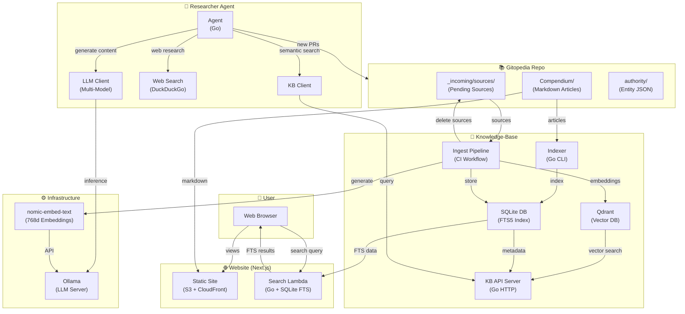
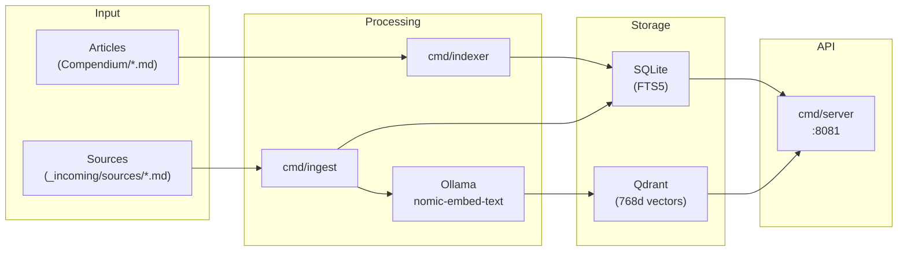
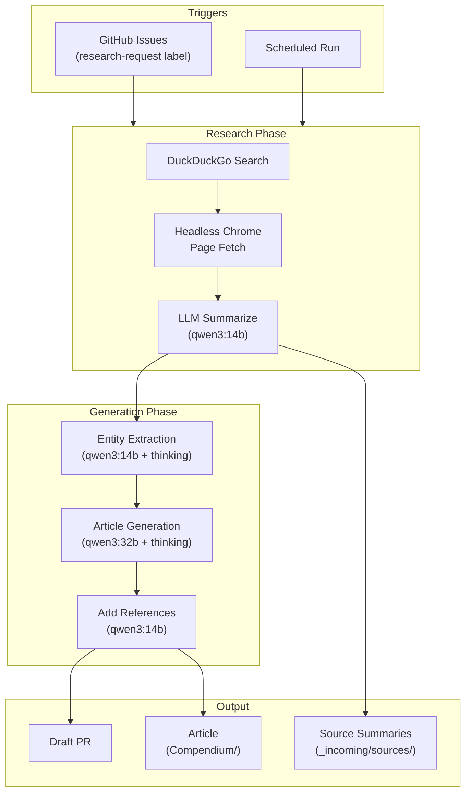
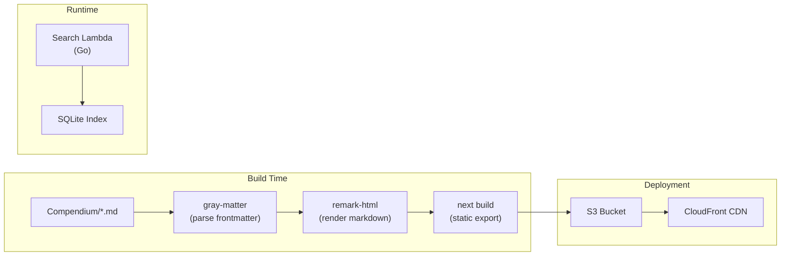
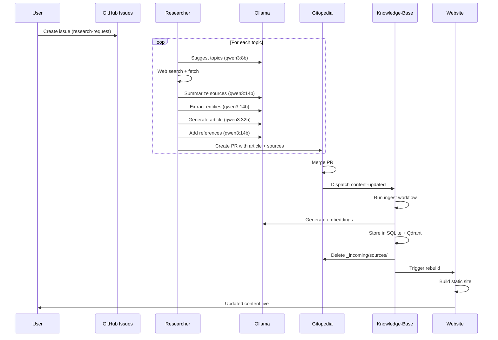
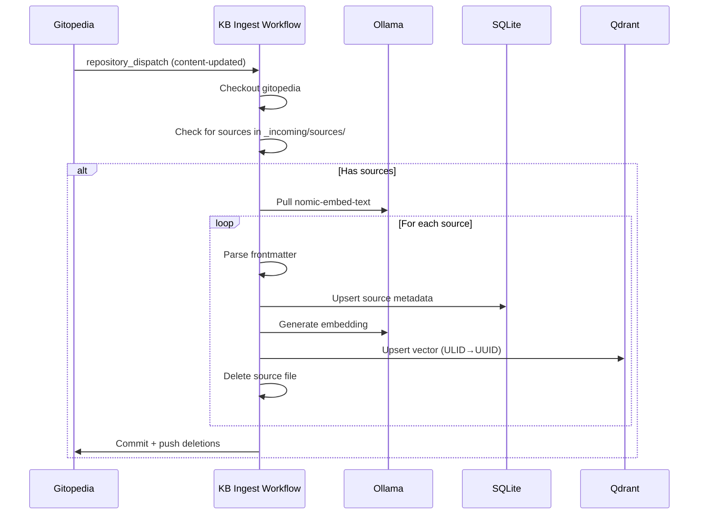

# Architecture

This document outlines how the Gitopedia system components interact to form a complete knowledge platform. The architecture has evolved to support multi-phase article generation with semantic search capabilities via a vector database.

## System Overview



## Component Details

### Gitopedia Repository (Content)

The central content repository containing all encyclopedia articles as Markdown files with YAML frontmatter.

**Directory Structure:**
```
Compendium/
├── Science/
│   ├── Physics/
│   │   ├── quantum-mechanics.md
│   │   └── index.md
│   └── index.md
├── _incoming/
│   └── sources/           # Pending source summaries (cleared by KB ingest)
├── _debug/                # Debug output (thinking traces, raw sources)
└── authority/
    ├── people.json        # Entity authority file
    ├── organizations.json
    └── ...
```

**Article Frontmatter:**
```yaml
---
id: 01KBCVQXJS3QK3JCRGTWBFH2A6  # ULID
title: Quantum Mechanics
author: Gitopedia Researcher
summary: An overview of quantum mechanics...
tags: [physics, quantum, science]
created: 2025-12-03T04:06:38Z    # UTC datetime
model: qwen3:32b                  # LLM used for generation
researcher_version: 0.3.5        # Researcher version
---
```

### Knowledge-Base Repository

Maintains the search index and vector embeddings for semantic search.



**Database Schema:**

```sql
-- Articles table with FTS5
CREATE TABLE articles (
    id TEXT PRIMARY KEY,           -- ULID
    title TEXT NOT NULL,
    path TEXT NOT NULL,            -- Relative path in Compendium
    author TEXT,
    summary TEXT,
    tags TEXT,                     -- JSON array
    meta_json TEXT                 -- Full frontmatter as JSON
);
CREATE VIRTUAL TABLE articles_fts USING fts5(title, summary, content);

-- Sources table
CREATE TABLE sources (
    id TEXT PRIMARY KEY,           -- ULID
    url TEXT UNIQUE,
    title TEXT,
    topic TEXT,                    -- Related article topic
    summary TEXT,
    language TEXT,
    model TEXT,                    -- LLM used for summarization
    created_at TEXT,
    tags TEXT                      -- JSON array
);
CREATE VIRTUAL TABLE sources_fts USING fts5(title, summary, content);
```

**Vector Collections (Qdrant):**
- `sources`: 768-dimension vectors with payload (url, title, topic, summary)
- `articles`: 768-dimension vectors with payload (title, path, category)

**ULID to UUID Conversion:**
Qdrant requires UUID format for point IDs. The knowledge-base automatically converts ULIDs to UUID format:
```
ULID:  01KBCVQXJS3QK3JCRGTWBFH2A6
UUID:  019ad9bb-f659-1de6-3933-10d716f88946
```

### Researcher Agent

The AI-powered agent that creates encyclopedia content automatically.



**Multi-Model Configuration:**
The researcher uses different models for different task complexities:

| Task | Model | Thinking Mode |
|------|-------|---------------|
| Topic Suggestion | qwen3:8b | No |
| JSON Conversion | qwen3:8b | No |
| Source Summarization | qwen3:14b | Yes |
| Entity Extraction | qwen3:14b | Yes |
| Article Generation | qwen3:32b | Yes |
| Reference Addition | qwen3:14b | No |

**Two-Step Article Generation:**
1. **Content Generation**: LLM generates article without references
2. **Citation Addition**: Separate LLM call adds footnote references `[^N]` based only on provided sources

This prevents hallucinated references by ensuring citations only come from actual sources.

### Website

Next.js static site with serverless search.



**Displayed Metadata:**
- Article creation datetime (UTC)
- LLM model used for generation
- Researcher version
- "Work in Progress" disclaimer

## Data Flow

### Content Creation Pipeline



### Source Ingestion Pipeline



## Versioning

The researcher agent uses semantic versioning stored in `researcher/VERSION`:

```
0.3.5
```

**Version Updates:**
- Git `post-commit` hook auto-increments patch version
- Version appears in article frontmatter (`researcher_version`)
- Version displayed on website footer and article list

**Changelog:**
Changes are documented in `researcher/CHANGELOG.md` following Keep a Changelog format.

## Infrastructure

### Local Development (Docker Compose)

```yaml
services:
  ollama:
    image: ollama/ollama:latest
    ports: ["11434:11434"]
    # GPU support enabled
    
  qdrant:
    image: qdrant/qdrant:latest
    ports: ["6333:6333", "6334:6334"]
    
  researcher:
    build: .
    depends_on: [ollama, qdrant]
```

### CI/CD Workflows

| Repository | Workflow | Trigger | Action |
|------------|----------|---------|--------|
| gitopedia | content-dispatch | push to main | Dispatch to knowledge-base |
| knowledge-base | ingest | repository_dispatch | Ingest sources, generate embeddings |
| knowledge-base | build-index | push to main | Rebuild article index |
| website | site-build | push to main | Build and deploy static site |

## Summary

The Gitopedia architecture enables fully automated encyclopedia content creation:

1. **Research**: AI agent searches web, summarizes sources
2. **Generate**: Multi-model LLM pipeline creates articles with proper citations
3. **Store**: Sources ingested into knowledge-base with vector embeddings
4. **Index**: Full-text and semantic search indexes maintained
5. **Publish**: Static site automatically rebuilt and deployed

All content flows through Git, ensuring version control and auditability. The use of ULIDs provides stable cross-repository references, while the vector database enables future semantic search and RAG capabilities.
