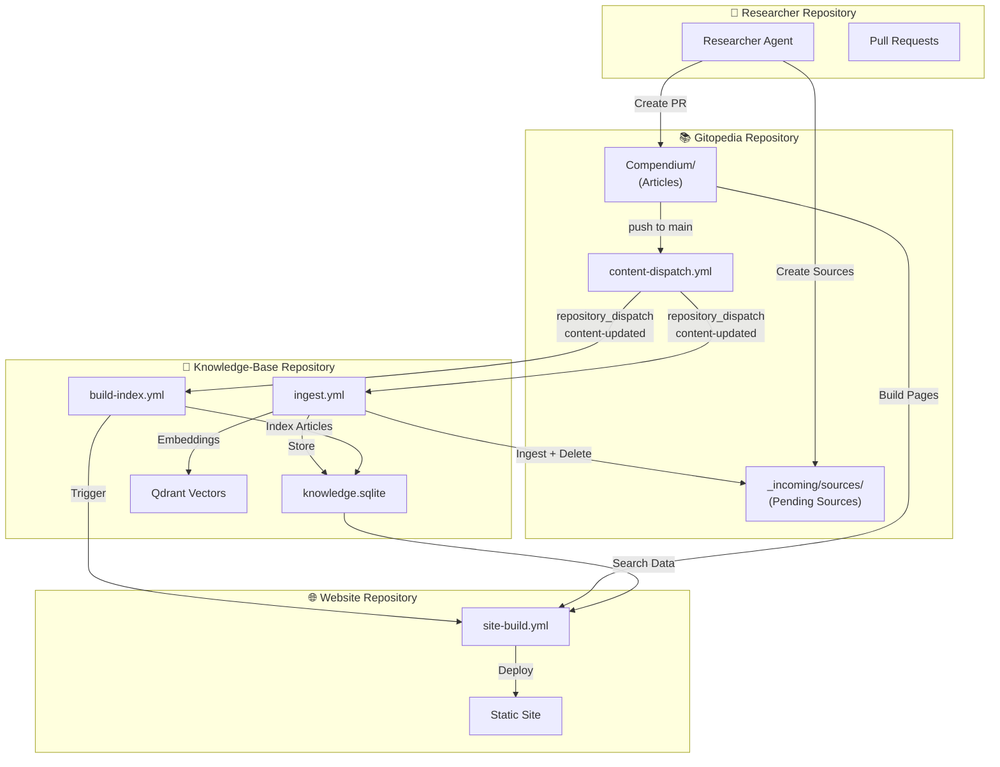
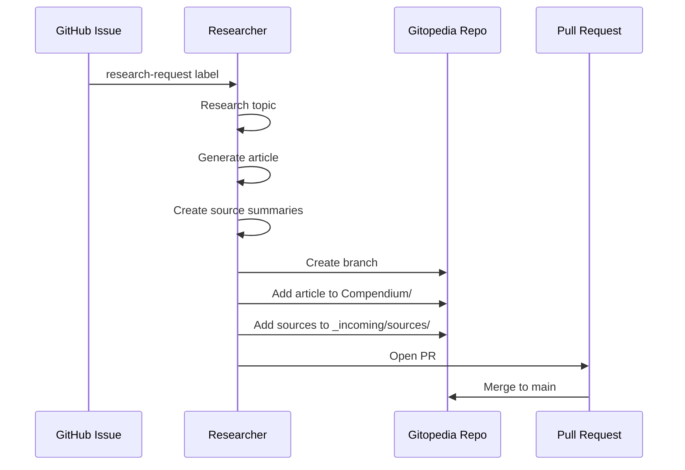
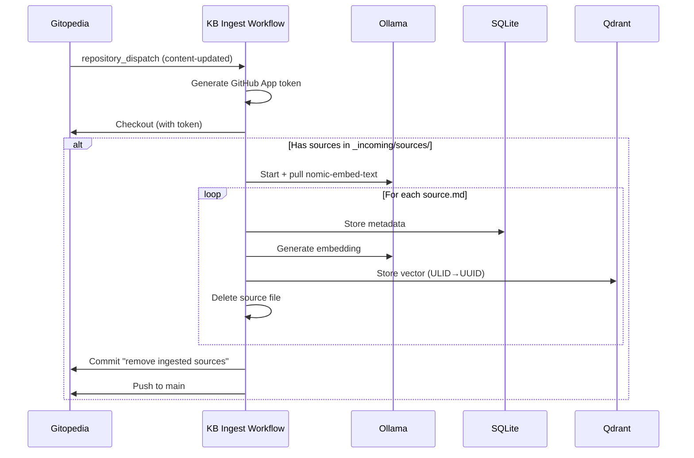
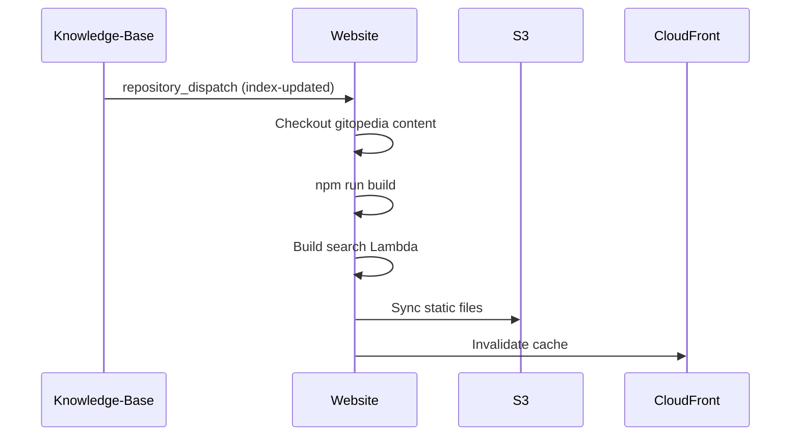
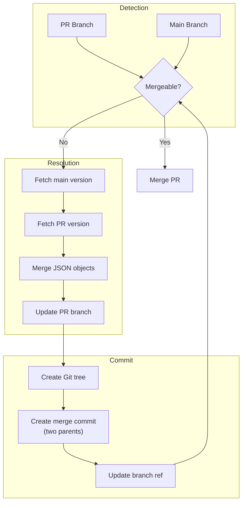
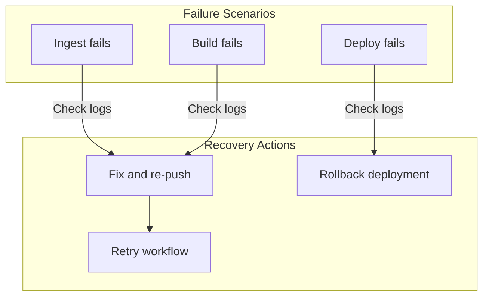

# Integration and Data Flow

This document describes how the four repositories (Gitopedia, Knowledge-Base, Researcher, and Website) coordinate with each other through GitHub Actions, webhooks, and shared data formats.

## System Integration Overview



## Cross-Repository Workflow

### 1. Content Creation (Researcher → Gitopedia)



### 2. Content Dispatch (Gitopedia → Knowledge-Base)

When content is pushed to Gitopedia's main branch:

```yaml
# gitopedia/.github/workflows/content-dispatch.yml
name: Dispatch Knowledgebase Build

on:
  push:
    branches: [main]

jobs:
  dispatch-kb:
    runs-on: ubuntu-latest
    steps:
      - name: Generate GitHub App token
        id: app-token
        uses: tibdex/github-app-token@v2
        with:
          app_id: ${{ secrets.GITOPEDIA_APP_ID }}
          private_key: ${{ secrets.GITOPEDIA_APP_PRIVATE_KEY }}
          
      - name: Dispatch to Knowledge-Base
        run: |
          curl -X POST \
            -H "Authorization: token ${{ steps.app-token.outputs.token }}" \
            -H "Accept: application/vnd.github+json" \
            https://api.github.com/repos/gitopedia/knowledge-base/dispatches \
            -d '{"event_type":"content-updated","client_payload":{"gitopedia_sha":"${{ github.sha }}"}}'
```

### 3. Source Ingestion (Knowledge-Base)

The knowledge-base ingests sources and cleans up the gitopedia repo:



### 4. Website Rebuild (Knowledge-Base → Website)

After indexing completes, the website is triggered to rebuild:



## GitHub App Authentication

Cross-repository operations use the `gitopedia-bot` GitHub App:

### Permissions

| Permission | Access | Purpose |
|------------|--------|---------|
| Contents | Read/Write | Checkout, commit, push |
| Issues | Read/Write | Monitor research requests |
| Pull requests | Read/Write | Create and merge PRs |
| Actions | Write | Trigger workflows via dispatch |

### Token Generation

```yaml
- name: Generate GitHub App token
  id: app-token
  uses: tibdex/github-app-token@v2
  with:
    app_id: ${{ secrets.GITOPEDIA_APP_ID }}
    private_key: ${{ secrets.GITOPEDIA_APP_PRIVATE_KEY }}

- name: Use token
  env:
    GITHUB_TOKEN: ${{ steps.app-token.outputs.token }}
  run: |
    # Token is available for API calls and git operations
```

### Bot Identity

Commits made by workflows use the bot identity:

```yaml
git config user.name "gitopedia-bot[bot]"
git config user.email "gitopedia-bot[bot]@users.noreply.github.com"
```

## ULIDs for Unified Identification

All content uses ULIDs (Universally Unique Lexicographically Sortable Identifiers) as primary keys:

### ULID Properties

- **128-bit**: Same size as UUID
- **Lexicographically sortable**: Sorts by creation time
- **URL-safe**: Base32 encoding (26 characters)
- **Timestamp embedded**: First 48 bits are millisecond timestamp

### Example

```
ULID: 01KBCVQXJS3QK3JCRGTWBFH2A6
      ├─────────┼───────────────┤
      Timestamp   Randomness
      (48 bits)   (80 bits)
```

### Cross-System Usage

| System | Usage |
|--------|-------|
| Gitopedia | Article frontmatter `id` field |
| Knowledge-Base | SQLite primary key, Qdrant point ID |
| Website | Internal reference for search results |

### ULID to UUID Conversion

Qdrant requires UUID format. The knowledge-base converts ULIDs:

```
ULID:  01KBCVQXJS3QK3JCRGTWBFH2A6
UUID:  019ad9bb-f659-1de6-3933-10d716f88946
```

Both represent the same 128-bit value, just different string formats.

## Data Formats

### Article Frontmatter

```yaml
---
id: 01KBCVQXJS3QK3JCRGTWBFH2A6    # ULID
title: Article Title
author: Gitopedia Researcher
summary: Brief description...
tags: [tag1, tag2, tag3]
created: 2025-12-03T04:06:38Z      # UTC datetime
model: qwen3:32b                    # LLM used
researcher_version: 0.3.5          # Agent version
---
```

### Source Summary Frontmatter

```yaml
---
id: 01KBCVV7ZH35494W06HSEE5C17
title: Source Title
url: https://example.com/article
related_article: quantum-mechanics
language: en
model: qwen3:14b
created: 2025-12-03T04:05:00Z
tags: [physics, quantum]
---

Summary content...
```

### Authority Files

Entity references are stored in JSON authority files:

```json
// authority/people.json
{
  "albert-einstein": {
    "name": "Albert Einstein",
    "description": "Theoretical physicist",
    "articles": ["01KBCVQXJS3QK3JCRGTWBFH2A6"]
  }
}
```

## Merge Conflict Resolution

The researcher automatically resolves conflicts in authority files and category indexes:



## Version Coordination

### Researcher Version

- Stored in `researcher/VERSION`
- Auto-incremented on commit (git hook)
- Embedded in article frontmatter
- Displayed on website

### Content Version

- Git commit SHA identifies content state
- Passed in `repository_dispatch` payload
- Used to ensure index matches content

### Index Version

- SQLite database timestamp
- Artifact upload with retention
- Website fetches latest

## Error Handling

### Pipeline Failures



### Sync Verification

The website build verifies content matches index:
1. Check gitopedia commit SHA in dispatch payload
2. Checkout that specific commit
3. Build with matching index artifact

## Workflow Summary

| Event | Source | Target | Action |
|-------|--------|--------|--------|
| Push to main | Gitopedia | Knowledge-Base | Dispatch content-updated |
| content-updated | Knowledge-Base | Ingest workflow | Ingest sources, delete files |
| content-updated | Knowledge-Base | Build workflow | Rebuild article index |
| Index complete | Knowledge-Base | Website | Trigger site rebuild |
| Site build | Website | S3/CloudFront | Deploy static site |

## Secrets Required

| Repository | Secret | Purpose |
|------------|--------|---------|
| All | `GITOPEDIA_APP_ID` | GitHub App ID |
| All | `GITOPEDIA_APP_PRIVATE_KEY` | GitHub App private key |
| Website | `AWS_ACCESS_KEY_ID` | S3 deployment |
| Website | `AWS_SECRET_ACCESS_KEY` | S3 deployment |
| Website | `CLOUDFRONT_DISTRIBUTION_ID` | Cache invalidation |
